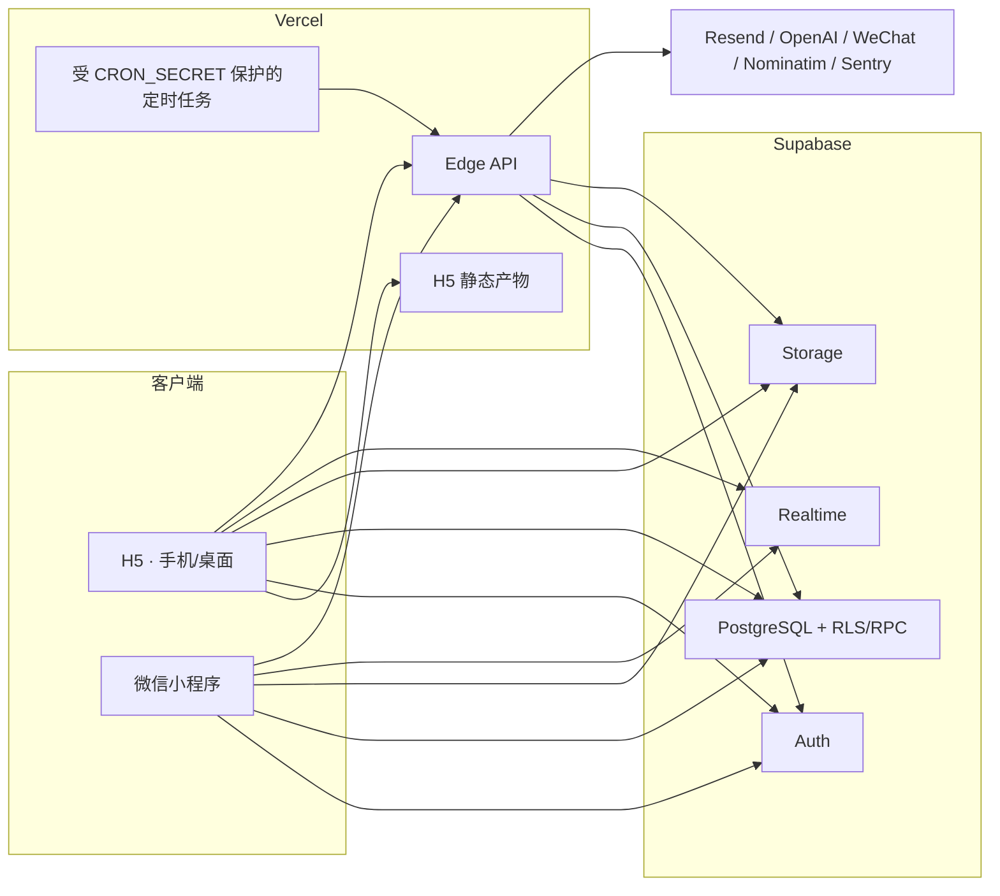

# Illini Market 技术架构

> 最后更新：2026-07-19
> 仓库状态：数据库已进入生产 34/35、应用尚待 matching canary 的 release candidate
> 生产边界：已应用迁移与仓库当前 SQL/ledger 逐字一致；仅 WeChat 密码凭据退役
> 迁移 `18140000` 待 passwordless canary。候选 API、H5 和小程序文件存在于
> 工作树不代表稳定应用已经上线。

## 系统总览



客户端由 uni-app、Vue 3 和 TypeScript 维护一套代码，输出 H5 与
`mp-weixin`。Node 22 是安装、CI、构建和运维脚本基线；`api/` 中的线上
函数使用 Vercel Edge runtime 和 Web API，不应依赖 Node-only runtime
行为。

## 信任边界

| 边界 | 设计 |
|---|---|
| 普通用户 | Supabase session JWT；所有浏览器/小程序直连表和 Storage 操作同时受 table ACL、RLS、列权限、约束/trigger 或 account-bound RPC 限制 |
| 管理员 | 与普通用户 session 分离；每位管理员持有独立 `iam_admin_...` bearer，签发 CLI 绝不 stdout、只创建 `0600` recovery/output；数据库仅保存 SHA-256 hash、从权威 profile 派生的 identity snapshot、角色、actor、到期、case/approval、撤销和幂等/审计状态 |
| 服务端 | `SUPABASE_SECRET_KEY` 优先，legacy service-role key 仅作滚动兼容；opaque secret key 只进入 `apikey`，不能伪装成 JWT |
| 外部 provider | 只从受限 Edge route 调用；方法、origin、认证、限流、总超时、响应字节、重定向和稳定错误均 fail-closed |
| 生产变更 | 迁移前只读 PRECHECK，备份与 staging rehearsal；迁移后 VERIFY、事务内 REGRESSION、A/B/admin 权限矩阵和 provider canary |

公开 Vite 变量只允许 Supabase URL、publishable/legacy anon key、应用 origin
等客户端值。service-role、secret、cron、Resend、OpenAI、Sentry 管理凭据不得
进入 `VITE_*` 或客户端存储。非 H5 构建必须显式提供合法 `VITE_BASE_URL`；
缺失时不回退到生产域名。

## 主要数据域

本文描述的是候选链最终形态，精确列、grants、policies 和函数以按顺序执行
的 `supabase/migrations/` 及对应 PRECHECK/VERIFY/REGRESSION 为准。

| 数据域 | 关键对象与约束 |
|---|---|
| 身份与公开资料 | `auth.users`、`profiles`、consent/onboarding、Illini email verification；公开资料字段与私密信任/身份字段分离 |
| 商品 | `items`、收藏、关注、浏览去重、saved searches；状态机约束 active/reserved/sold/deleted，终态和所有者写入由数据库强制 |
| 成交与评分 | accepted offer 生成私有精确成交归属；sold 操作绑定唯一 offer/双方/价格；评分只允许该成交双方互评，不从“存在会话”猜买家 |
| 私信 | `conversations`、`messages`、`offers`、`meetups`、per-user archive；消息目前为文本、emoji、sticker 和结构化交易事件，公共聊天媒体上传已关闭 |
| 社区广场 | `posts`、`post_items`、likes、comments、banners；匿名只看 active 且未被 moderation/停权隐藏的内容 |
| 安全治理 | `reports`、不可变 evidence snapshot、suspensions、appeals、fingerprint advisory signal、admin audit；指纹不是自动封禁证据 |
| 通知与邮件 | in-app `notifications`、conversation attribution、原子 reminder seeding、共享 email claim/lease/provider key；即时 meetup 与 digest 不能竞争重复投递 |
| 运维 | account-deletion durable saga、ephemeral retention、recoverable banner upload ledger/GC、edge rate-limit buckets |

数据库设计遵循三层约束：

1. table ACL 决定角色是否能尝试某类操作；
2. RLS 决定可见/可变更的行；
3. 列 grant、CHECK、trigger 与 SECURITY DEFINER RPC 强制服务器字段、状态机、
   身份 intent、审计和跨表原子性。

不能用“RLS 已开启”替代后两层。所有 SECURITY DEFINER 函数固定安全
`search_path`，撤销默认 `PUBLIC` EXECUTE，再按角色显式授权。

## Realtime 与私信

H5/小程序只订阅精确 conversation topic。客户端先完成 Realtime auth
handshake，再为当前账号拥有的会话加入 private channel；退出、换号、页面
卸载都会移除 channel 和 fallback 请求。`realtime.messages` 的 RLS 只授权
conversation participant 使用 broadcast/presence；Postgres Changes 的真实
数据读取继续由源表 RLS 决定。

`realtime.messages` 是 Supabase Realtime 管理的表，不是应用 Data API 表。
平台 owner 可以保留对 API roles 的非 grantable S/I/U base ACL；应用只拥有
两条 authenticated SELECT/INSERT policy，不对该托管表执行 GRANT/REVOKE。
安全验证同时拒绝 PUBLIC、列 ACL、非 owner grantor、grant option、父角色继承
及 DELETE/TRUNCATE/REFERENCES/TRIGGER/PG17 MAINTAIN 等危险能力；并要求
authenticated 保有 `conversations.id/buyer_id/seller_id` 列读取、
`public/auth/private/realtime` schema USAGE，以及 `auth.uid()`、
`realtime.topic()`、私有 pair-access helper 的 EXECUTE，避免策略存在却无法执行。

小程序或 websocket 不可用时使用 account-bound、超时/字节受限的轮询；降级
不能绕过 block、suspension 或 conversation participant 判断。

## Storage 与媒体

| Bucket/路径 | 当前候选边界 |
|---|---|
| `item-images/<uid>/...` | raster image only；客户端与数据库统一 5 MiB；对象 owner/path、数量与总字节 quota 由数据库验证；商品、头像和广场引用走各自允许的 public resource contract |
| 公共聊天 | text-only；不再保留可调用的视频/图片上传 helper，避免 Storage policy 与 UI 能力漂移 |
| `banners/...` | 仅 owner-capability 管理员经 prepare/upload/complete saga 写入；新建或变更 banner 必须引用已完成的精确 managed ledger 对象；GC 使用 lease，避免误删仍在引用的对象 |

客户端上传全部绑定 captured account generation；确定失败才补偿删除，网络超时
或响应丢失按 commit-unknown 处理，不能为了 UI 看起来干净而误删已提交对象。

## 管理员后台

`/pages/admin/index` 是同一客户端中的受锁管理面，token 只保存在页面内存，
刷新/离开即丢失。API 先验证 token、role/capability、trusted request metadata
和速率，再调用原子管理 RPC。

- `operator`：日常举报与内容/账号处置；
- `security_admin`：安全调查与 token inventory/revoke；
- `owner`：高权限恢复、banner 和受限平台配置。

业务写、角色检查、actor attribution、幂等结果和 required audit 在同一数据库
事务内完成；审计失败必须回滚该业务写。只读探针或监控的 best-effort 日志不
能被误写成“所有 admin audit 都可失败后继续”。

常规 token 生命周期脚本只使用目标环境的 `ADMIN_API_ORIGIN` 和现有
`ADMIN_TOKEN` 走 `/api/admin`：issue 只允许 owner，revoke 允许
`security_admin`/owner。脚本不接受 Supabase secret/service-role key，也不直接
写 `admin_tokens`。issue 只接收权威 `profiles.id`，identity snapshot 由服务器
读取；有效期 1–365 天、默认 90 天。issue/revoke 都要求 case ID、approval
reference 与幂等键；email 只做大小写无关的 revoke dry-run snapshot 匹配，
多个 admin ID 必须告警并分别复核，apply 绑定 token ID 或 admin ID。inventory
明确区分 active/expired/revoked，它不是 audit history。

issue 的 `0600` JSON recovery manifest 同时包含 credential 与不可变请求/幂等
字段以及原签发者 token 的不可逆指纹，整体都按 secret 管理。文件内容与父目录在
请求发出前同步落盘；路径必须位于所有源码 checkout/Git worktree 之外的受控私有
vault 目录，CLI 会解析符号链接祖先并在联网/生成明文前拒绝仓库内路径。网络结果
不确定或返回 409 时必须用
`--resume-file ... --apply` 配合**原 owner token**，以原请求/原幂等键恢复；换一
枚 owner token 会被 resume 本地拒绝且保留 manifest。若原 token 已失效，替代 owner
只能用只读 `--reconcile-file` 按 manifest token hash 和精确 role/expiry 对账；仍
绑定原 admin ID，唯一例外是账号删除已将该行原子撤销并解绑为
`admin_id = null + revoked_at`。这种结果只证明签发曾提交且凭据现已不可用，CLI
明确禁止入 vault；无匹配或畸形结果都保留文件，不能再生成一份凭据或猜测是否
提交。staging
disposable rehearsal 与 production
approval 是不同门禁；生产 privileged/owner-continuity 变更需要独立复核。首个
owner bootstrap 属于外部受控 break-glass 流程，不能通过常规 CLI 的 service-key
后门实现。候选客户端统一使用 `Authorization: Bearer`; `x-admin-key` 仅是临时
兼容，不得用于新 UI/工具。

`iam_admin_` 前缀只提供可检测格式，不自动保证 GitHub 会拦截。仓库必须配置并
验证 custom secret pattern 与 push protection，并用 synthetic 值测试规则。

## 邮件、定时任务与外部服务

Vercel cron 只调用带精确 Bearer `CRON_SECRET` 的路由。真实通知邮件还要求
显式 live 开关和显式 HTTPS app origin；test 模式只能生成 synthetic sample，
不能把生产通知内容发往测试地址。数据库 claim/lease 负责 immediate 与 digest
之间的唯一投递所有权，Resend idempotency key 在 provider 结果不确定后保持
sticky。

Provider 错误只进入固定错误码/净化摘要。日志、Sentry breadcrumb、URL 和
exception context 不得包含 token、恢复 code、邮件、手机号、精确位置、用户
正文或任意 PostgREST/provider message。

## 账号删除与证据

注销是 durable saga：先建立不可回退的 job/tombstone，枚举并删除账号自有
Storage，对 Auth 删除，清理旧 WeChat password map，最后将 job 标记完成并
擦除临时标识。任一步失败保留单调阶段，由受保护 worker 续跑；不能先删除
Auth 再让用户凭证承担剩余清理。

普通用户删除会话已改为 per-user archive，不删除另一方的共享记录。账号注销
仍按 schema FK 删除该账号的 live 数据；举报在删除前形成受限 evidence snapshot，
但图片 URL 不是二进制证据副本，Storage 删除后可能不可用。具体对外承诺以当前
隐私政策为准。

## 项目结构

```text
CAACI_Community_Marketplace_Bazaar/
├── api/                    Vercel Edge API 与 Node boundary tests
├── app/
│   ├── src/api/            客户端 transport、account scope、admin journal
│   ├── src/components/     共享 UI、chat、avatar、empty state、navigation
│   ├── src/composables/    auth/data/realtime/upload/session logic
│   ├── src/pages/          pages.json 中声明的 H5/mp routes
│   ├── src/utils/          runtime、媒体、安全、telemetry helpers
│   └── smoke/              deterministic contracts 与浏览器 smoke
├── docs/                   架构、环境、安全、admin、审计与真机门禁
├── scripts/                运维 CLI 与静态/安全/迁移边界测试
├── supabase/
│   ├── migrations/         唯一可部署的有序 schema 变更
│   └── _ops/               PRECHECK / VERIFY / rolled-back REGRESSION / bootstrap
├── tests/k6/               默认无 target、生产需显式确认的破坏性压测
├── .github/workflows/      Node 22 CI、构建、boundary 与条件 smoke
└── vercel.json             H5 build、Edge routes、headers 与 cron
```

## 构建与发布

本地和 CI 使用：

```bash
cd app
npm ci --legacy-peer-deps
npm run type-check
npm run build:h5
npm run build:mp-weixin
```

发布不是“构建通过”这一件事。完整门禁还包括：

1. Node 22 全量 deterministic tests 与 production dependency audit；
2. 两个独立 PostgreSQL 16 实例完成全部历史 + 候选迁移、适用 ops、候选重入
   和 normalized schema diff；
3. Vercel 本地构建与 route/runtime/headers 检查；
4. 应用内浏览器的 desktop/mobile、公开端、管理员锁屏/错误态/键盘旅程；
5. staging 真实双账号、Storage、Realtime、email/provider 和微信真机矩阵；
6. 生产备份、ledger/drift 对账、明确授权、迁移后 verify/canary/监控。

依赖安全与软件许可证是不同门禁。production dependency audit 当前可以为零，
但 DCloud 锁定的 Vite dev-tool finding 仍需按
[`NPM_DEPENDENCY_TRIAGE.md`](./NPM_DEPENDENCY_TRIAGE.md) 单独处理；新增依赖则继续受
[`THIRD_PARTY_NOTICES.md`](../THIRD_PARTY_NOTICES.md) 的许可证漂移门禁约束。
